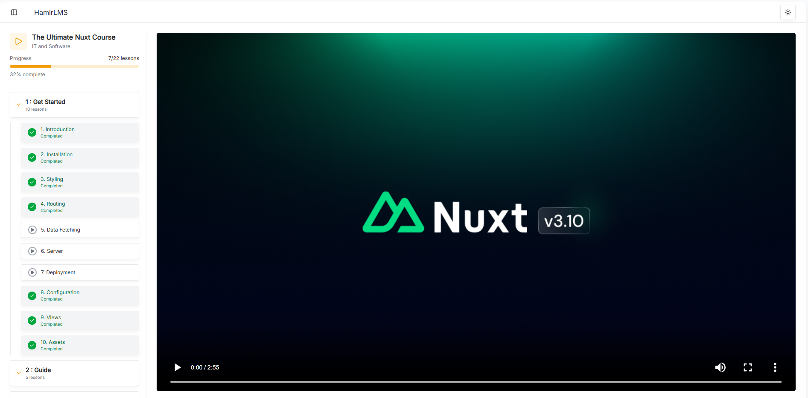

# Hamir LMS

This was built because I want to learn NextJs. Credits to this 24-hour [tutorial](https://youtu.be/xqoYkX4hfwg?si=h1qvz1GIaDNCPg99), I think I got the gist of how the framework works now. Not a 1 to 1 copy

## Screenshots

- Hero/Landing page
  

- User dashboard
  

- Admin dashboard
  

- drag and drop!
  

## Technologies

- [NextJS](nextjs.org)
- [React](https://react.dev/)
- [shadcn/ui](https://ui.shadcn.com/) - the hottest new UI components
- [Stripe](https://stripe.com/) - handles payments. I plan to add Paymongo in the future.
- [Prisma ORM ](https://www.prisma.io/orm)- for typesafe queries
- [PostgresDB](https://neon.com/) - hosted on Neon
- [Arcjet](https://arcjet.com/) - for security (disabled as it failed to run on Netlify)
- [react-dnd-kit](https://dndkit.com/) - for drag and drop
- [Tigris](https://www.tigrisdata.com/) - for the S3 bucket
- [nodemailer](https://nodemailer.com/) - for sending email verification OTP
- [Tiptap](https://tiptap.dev/) - for the fancy rich-text editor
- [better-auth](https://www.better-auth.com/) - Makes authentication setup painless, framework-agnostic too.
